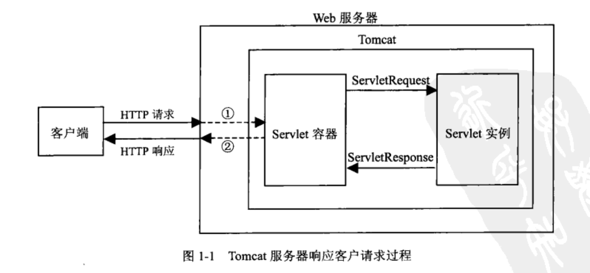
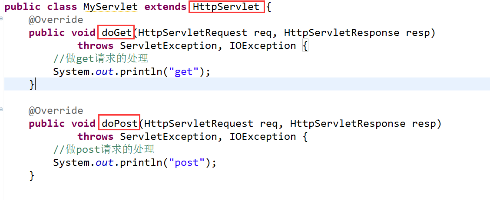

----

[TOC]

----


### Tomcat

#### intro

Tomcat是一个web服务器，也是servlet容器。通过它我们可以很方便地接收和返回到请求（如果不用Tomcat，那我们需要自己写Socket来接收和返回请求）。

web服务器接收到请求后，传递给servlet容器，容器加载servlet，产生实例并向其传递request。

### Servlet[^1]

#### intro

在B/S模式，即浏览器/服务器模式中，需要http请求和响应。

servlet是一个类，提供了一种java规范，只要按照规范写，就可以从request中取值，操作session等，不需要在意服务器底层的实现。即能接受并处理请求。

servlet容器，即servlet引擎。servlet没有main方法，需要部署在servlet容器中，由容器来实例化和调用servlet方法。

接收到http请求之后，容器将http request封装为Servlet中的request对象，我们可以取出request中的http信息操作，再将数据封装为Servlet中的response对象，应用容器解析该response并封装为http response。



#### example

以下为servlet接口实现：

其中service为关键，Tomcat（servlet容器）将http请求封装为ServletRequest，传入给servlet处理，

```java
public interface Servlet {

    public void init(ServletConfig config) throws ServletException;

    public ServletConfig getServletConfig();

    public void service(ServletRequest req, ServletResponse res)
            throws ServletException, IOException;

    public String getServletInfo();

    public void destroy();
}
```

以下为Servlet实例：




#### 配置

在web.xml中配置，让浏览器知道发出的请求到达哪个servlet，即Tomcat将servletrequest传递给相应的servlet。

具体见[^1]

### JSP[^2]

java server pages，动态网页技术。传统网页HTML插入Java程序段。为了简化Servlet，Servlet输出HTML困难。

JSP的本质是servlet，在第一次访问时会被编译为HTTPservlet的子类，

所以，我们一般的模式是：在Servlet处理好的数据，转发到JSP，JSP只管对小部分的数据处理以及JSP本身写好的页面。即用servlet编写逻辑层，用JSP来写展示层。

JSP弊端：

- 必须在支持java的web服务器中运行。
- 第一次请求jsp，会编译为servlet，速度慢。
- 每次请求jsp都会先访问servlet，再输出html，效率低。
- jsp中内容多加载会很慢。
- 警示牌中动态和静态资源耦合在一起，服务器压力大。


具体操作过程：

1. 客户端请求
2. servlet、controller接收请求
3. 调用service、dao完成业务逻辑
4. 返回jsp
5. jsp展示


### JavaBean

包括：

1. 封装数据的javaBean，实体类。有set、get操作。
2. 封装逻辑的javaBean，用于实现业务逻辑。比如servlet或Dao对象

其中，所有属性都是private，


### 参考

[^1]:[Java Web(一) Servlet详解！！ - 有梦想的老王 - 博客园 (cnblogs.com)](https://www.cnblogs.com/whgk/p/6399262.html)
[^2]:[JSP介绍与简单使用_端碗吹水的技术博客_51CTO博客](https://blog.51cto.com/zero01/2044929)