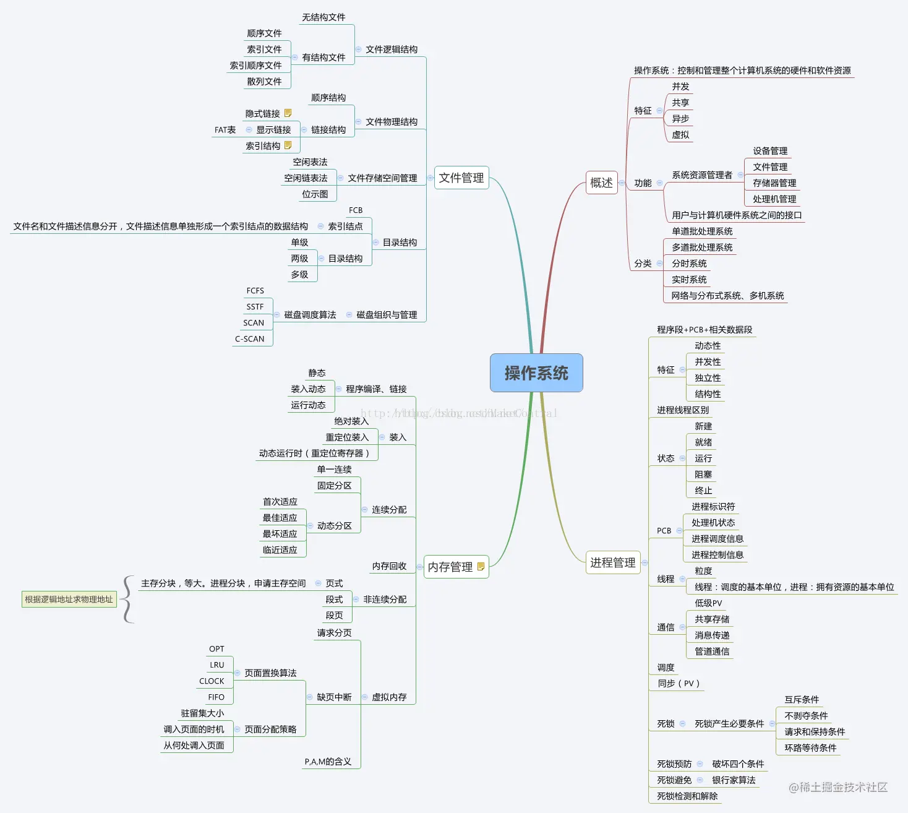

----

[TOC]

----

### 总结图

### 概述

#### 操作系统是什么？[^1]

是运行在内核态的软件，是应用程序和硬件之间的媒介，向程序提供硬件的抽象，管理硬件资源。

#### 操作系统的功能

- 进程管理
- 内存管理
- 文件管理
- IO管理

#### 用户态和内核态

**【内核】**[^1]

用户态和内核态切换[^1]：通过系统调用，执行陷入指令，产生中断。

#### 操作系统四个特性

- 并发：进程同一时间段内可以并发执行
- 共享：系统中的资源可以被并发进程共同使用
- 虚拟：通过时间（时分复用）、空间（虚拟内存）虚拟技术把一个物理实体虚拟为多个
- 异步[^2]：在多道程序环境下，允许多个程序并发执行，但由于资源有限，进程的执行不是一贯到底。而是走走停停，以不可预知的速度向前推进，这就是进程的异步性。异步性使得操作系统运行在一种随机的环境下，可能导致进程产生与时间有关的错误。但是只要运行环境相同，操作系统必须保证多次运行程序，都获得相同的结果。

### 参考

[^1]:[操作系统常见面试题 - 掘金 (juejin.cn)](https://juejin.cn/post/7014301927408140296)

[^2]:[计算机操作系统的异步性是什么？_百度知道 (baidu.com)](https://zhidao.baidu.com/question/817427629352517852.html)

