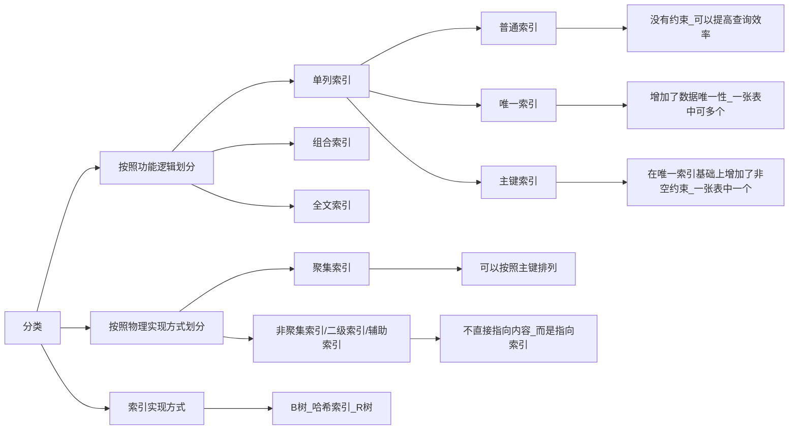
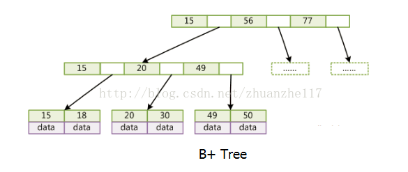
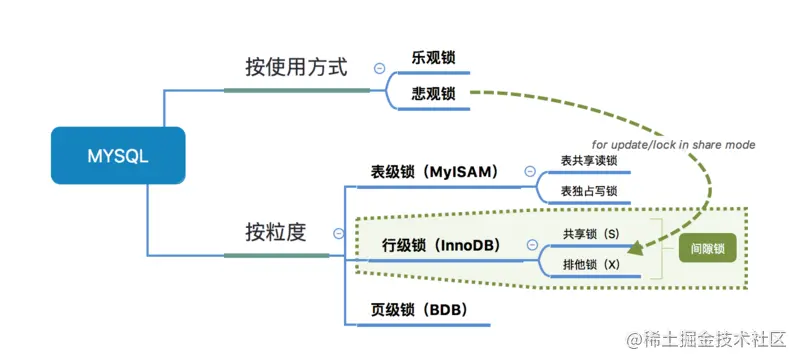

[TOC]

------

### 数据库基础概念

#### SQL和MySQL

**【SQL，Structured Query Language，结构化查询语言】**SQL 是一种 **结构化查询语言**，用于在数据库上执行各种操作。

**【MySQL】** MySQL 是一个 **关系数据库管理系统（RDBMS）**，使用 SQL 执行所有数据库操作。MySQL是软件。

#### 三大范式[^1]

- 第一范式（1NF）：列的原子性，即每个属性/每个列的信息只能有一种，不能再分解为几个属性。
- 第二范式（2NF）：其他属性字段必须依赖于全部主键，不能部分依赖。
  - 存在问题[^2]
- 第三范式（3NF）：在2NF的基础上，其他属性不能依赖于其他非主键属性。

### 索引[^3]

> 关键字：每条数据记录为{key，value}，关键字相当于key，唯一。data为具体数据。

#### 索引分类[^16]

单列索引：一个索引只包含一个列的属性，按照这个属性索引，一个表可以有多个单列索引。

组合索引：包含两个以上的列。

普通索引：根据表中任何一个列/属性建立索引

唯一索引：

#### B树

- 非叶节点存储【关键词、数据、指针】
- 叶节点存储【关键字、数据】，叶节点包含部分数据
- m阶B树关键字树最大=m-1，子分支（指针数）=关键字+1

#### B+树

- 非叶节点存储【关键字、指针】
- 叶节点存储【关键字、数据】，叶节点包含全部数据
- 叶节点之间有链指针
- m阶B+树有最多有m个关键字，子分支=关键字数

*MySQL：InnoDB为存储引擎之一，使用B+树。查找索引的实现[^4]*，为什么选择B+树？[^5][^6]

#### Hash索引[^12]

使用哈希算法，将数据库字段转化为Hash值。

检索的时候计算Hash值，获取对应数据的指针位置。

*缺点*：不能用于模糊查询，范围查询[^7]

#### 位图索引

如果某列只有较少值，如性别只有两个值，使用两个位图男，女，如果男位图中该位标记为0表示非男，1表示男。查找男性时，只需要在男位图中查找值为1的。

#### 聚集索引、非聚集索引[^19][^20][^21]

**【聚集索引】**索引和数据存放在一起。即按照数据的物理存储划分，如果是在索引中查找id=4，找到id则对应的数据也在附近。

聚集索引的顺序就是数据的物理存储顺序。它会==根据聚集索引键的顺序来存储表中的数据==，即对表的数据按索引键的顺序进行排序，然后重新存储到磁盘上。因为数据在物理存放时只能有一种排列方式，所以一个表只能有一个聚集索引。

**【非聚集索引】**索引结构和数据分开，强调逻辑分类，需要一个索引表，每个索引对应一个地址，该地址存放数据，索引不需要按照数据的物理地址排序。非聚集索引可以不使用主键，而是在地址的位置放主键。

*聚集索引和非聚集索引的根本区别是**表记录的排列顺序和与索引的排列顺序是否一致。***

如果都使用B+树，聚集索引的叶节点都是数据，非聚集索引的叶节点都是数据的地址。

#### 稠密索引、稀疏索引[^21]

非聚集索引必是稠密索引。

#### 索引最左匹配原则[^13]

在联合索引中，key=(a, b, c, d)，有多个，从最左开始，遇到范围查询就停止匹配。

例如：b = 2 如果建立(a,b)顺序的索引，是匹配不到(a,b)索引的；但是如果查询条件是a = 1 and b = 2或者(又或者是b = 2 and a = 1)就可以，因为优化器会自动调整a,b的顺序。再比如a = 1 and b = 2 and c > 3 and d = 4 如果建立(a,b,c,d)顺序的索引，d是用不到索引的，因为c字段是一个范围查询，它之后的字段会停止匹配。

### 事务

数据库的 事务（Transaction）是一种机制、一个操作序列，包含了一组数据库操作命令，其执行的结果必须使数据库从一种一致性状态变到另一种一致性状态。事务把所有的命令作为一个整体一起向系统提交或撤销操作请求，即这一组数据库命令要么都执行，要么都不执行，因此事务是一个不可分割的工作逻辑单元。如果任意一个操作失败，那么整组操作即为失败，会回到操作前状态或者是上一个节点。

因此，事务是保持 逻辑数据一致性 和 可恢复性 的重要利器。而锁是实现事务的关键，可以保证事务的完整性和并发性。

#### 四大特性ACID

- 原子性
- 一致性：事务完成时，多个事务对某个数据的读取结果相同。
- 隔离性：并发访问时，一个用户的事务不被其他事务干扰。提交后再访问。
- 持久性：事务提交后，对数据库中数据的改变是永久的。

#### 事务之间的相互影响[^8]

- 脏读[^9]

- 脏写[^9]：无论是脏写还是脏读，都是因为一个事务去更新或者查询了另外一个还没提交的事务更新过的数据。因为另外一个事务还没提交，所以它随时可能会回滚，那么必然导致你更新的数据就没了，或者你之前查询到的数据就没了，这就是脏写和脏读两种场景。

- 不可重复读[^9]：事务A要多次读取值X，而事务B和C在A第一读之后先后更新X值，A就会读到三个不同的值。如果事务A希望的是同一个值，则该问题为不可重复读。

  > *解决：每个事务设置一个版本号，多次读取数据只能读取早于当前版本号的数据。*

- 幻读[^10]：事务A查询数据库并修改10条数据，事务B插入2条。事务A再次查询后发现多了两条没有修改的数据。

  > 为了解决幻读问题，InnoDB 只好引入新的锁，也就是间隙锁 (Gap Lock)。间隙锁，是专门用于解决幻读这种问题的锁，它锁的了行与行之间的间隙，能够阻塞新插入的操作。

- 丢失更新[^8]：事务A和B先后修改X值，B后修改覆盖了A修改过得值。导致A的更新丢失。

#### 事务的隔离级别[^11]

| 隔离级别   | 解释                       | 脏读/写 | 不可重复读 | 幻读 | 丢失更新 |
| ---------- | -------------------------- | ------- | ---------- | ---- | -------- |
| 读取未提交 | 事务A可以在事务B未提交时读 | √       | √          | √    | √        |
| 读取已提交 | 事务A只能在事务B提交后读取 | ×       | √          | √    | √        |
| 可重复读   | 事务A中对值X的多次读取相同 | ×       | ×          | √    | ×        |
| 可串行化   | 事务串行化执行             | ×       | ×          | ×    | ×        |

*Oracle默认采取读取已提交，只能解决脏读*

### 锁[^12]

#### 行锁

**【共享锁/读锁，S锁】**：多个事务可以同时读，但不允许写。

**【排它锁/写锁，X锁】**：阻塞其他读写锁，不能同时再读写。

#### 意向锁

属于表锁，可以实现细粒度的锁。

**【意向共享锁，IS】**：给数据行加锁

**【意向排它锁】**

#### 乐观锁、悲观锁[^17]

**【乐观锁】**：假设不会发生冲突，在提交操作时验证是否发生冲突。适用于读多写少的场景。

**【悲观锁】**：假设会发生冲突(存在并发修改），在查询的时候就加锁，直到提交。数据库中的行锁，表锁，读锁，写锁，以及 syncronized 实现的锁均为悲观锁。

乐观锁实现[^18]：乐观锁通常是通过在表中增加一个版本(version)或时间戳(timestamp)来实现，其中，版本最为常用。

如何选择：

- 乐观锁适用于读多写少的场景，可以省去频繁加锁、释放锁的开销，提高吞吐量
- 在写比较多的场景下，乐观锁会因为版本不一致，不断重试更新，产生大量自旋，消耗 CPU，影响性能。这种情况下，适合悲观锁

### SQL语句

#### 分类

| 类别            |                        |
| --------------- | ---------------------- |
| 数据查询语言DQL | SELECT                 |
| 数据操纵语言DML | UPDATE、INSERT、DELETE |
| 数据定义语言DDL | CREATE                 |
| 数据控制语言DCL | GRANT、COMMIT          |

#### 键[^14]

**【主键】**

**【外键】**

**【超键】**

**【候选键】**

#### drop、delete、truncate[^15]

**【drop】**删除表及表结构

**【truncate】**删除表内容，保留结构

**【delete】**删除表中数据行

### 参考

[^1]:[关系型数据库设计：三大范式的通俗理解  (cnblogs.com)](https://www.cnblogs.com/wsg25/p/9615100.html)
[^2]:[数据库逻辑设计之三大范式通俗理解，一看就懂，书上说的太晦涩 - SegmentFault 思否](https://segmentfault.com/a/1190000013695030)
[^3]:[数据库知识手册 - LeetBook - 力扣（LeetCode）全球极客挚爱的技术成长平台](https://leetcode.cn/leetbook/read/database-handbook/pxvmk2/)
[^4]:[MySQL 是怎样运行 - B+树索引 - 掘金 (juejin.cn)](https://juejin.cn/post/6988702694160465956)
[^5]:[MySQL 索引 为什么 InnoDB 使用 B+树 - 掘金 (juejin.cn)](https://juejin.cn/post/7095334615916740645)
[^6]:[数据库知识手册 - LeetBook - 力扣（LeetCode）全球极客挚爱的技术成长平台](https://leetcode.cn/leetbook/read/database-handbook/pxwoqc/)
[^7]:[数据库知识手册 - LeetBook - 力扣（LeetCode）全球极客挚爱的技术成长平台](https://leetcode.cn/leetbook/read/database-handbook/pxd53i/)
[^8]:[数据库知识手册 - LeetBook - 力扣（LeetCode）全球极客挚爱的技术成长平台](https://leetcode.cn/leetbook/read/database-handbook/pxqmm3/)
[^9]:[大白话讲解脏写、脏读、不可重复读和幻读 - 知乎 (zhihu.com)](https://zhuanlan.zhihu.com/p/150107974)
[^10]:[面试官问我什么是幻读，被吊打了 - 知乎 (zhihu.com)](https://zhuanlan.zhihu.com/p/394037138)
[^11]:[数据库知识手册 - LeetBook - 力扣（LeetCode）全球极客挚爱的技术成长平台](https://leetcode.cn/leetbook/read/database-handbook/px3n2h/)
[^12]:[数据库两大神器【索引和锁】 - 掘金 (juejin.cn)](https://juejin.cn/post/6844903645125820424)
[^13]:[(4条消息) Mysql最左匹配原则_李歘歘的博客-CSDN博客_mysql最左匹配原则](https://blog.csdn.net/qq_42410605/article/details/122517756)
[^14]:[数据库知识手册 - LeetBook - 力扣（LeetCode）全球极客挚爱的技术成长平台](https://leetcode.cn/leetbook/read/database-handbook/px1ubi/)
[^15]:[数据库面试题(开发者必看) - 掘金 (juejin.cn)](https://juejin.cn/post/6844903569632526343)
[^16]:[那些年与面试官交手过的数据库索引 - 掘金 (juejin.cn)](https://juejin.cn/post/6844904193463943175)
[^17]:[什么是乐观锁、悲观锁_养歌的博客-CSDN博客_悲观锁和乐观锁](https://blog.csdn.net/wuhuayangs/article/details/122105519)

[^18]:[乐观锁-版本号实现方式_全栈独立开发者的博客-CSDN博客_版本号实现乐观锁](https://blog.csdn.net/java_yuan/article/details/93977351)
[^19]:[聚集索引和非聚集索引 简析与对比_Linias的博客-CSDN博客_聚集索引和非聚集索引的区别](https://xianshang.blog.csdn.net/article/details/85254407?spm=1001.2101.3001.6661.1&utm_medium=distribute.pc_relevant_t0.none-task-blog-2~default~CTRLIST~default-1-85254407-blog-123461296.pc_relevant_aa&depth_1-utm_source=distribute.pc_relevant_t0.none-task-blog-2~default~CTRLIST~default-1-85254407-blog-123461296.pc_relevant_aa&utm_relevant_index=1)
[^20]:[简单理解聚集索引和非聚集索引_码虫码农的博客-CSDN博客_聚集性索引和非聚集性索引](https://blog.csdn.net/a6686039/article/details/89019666?spm=1001.2101.3001.6650.8&utm_medium=distribute.pc_relevant.none-task-blog-2~default~BlogCommendFromBaidu~default-8-89019666-blog-50580639.pc_relevant_multi_platform_whitelistv1&depth_1-utm_source=distribute.pc_relevant.none-task-blog-2~default~BlogCommendFromBaidu~default-8-89019666-blog-50580639.pc_relevant_multi_platform_whitelistv1&utm_relevant_index=12)
[^21]:[mysql中的聚集索引(聚簇索引)、非聚集索引、稀疏索引、稠密索引_智慧的牛的博客-CSDN博客_聚集索引](https://blog.csdn.net/guzhangyu12345/article/details/96423704)
