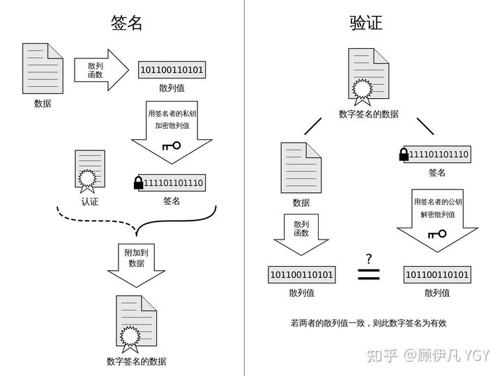

[TOC]

------

### HTTP

#### HTTP报文

1. 请求报文

   

2. 响应报文

   


#### HTTP请求方式

1. GET

   显示的请求指定资源，用于读取数据。

   GET的参数在URL中，不安全，而POST的参数在body体中。

   ```html
   http://127.0.0.1:5000/book?name=python
   ```

   

2. POST

   用于向指定资源提交数据。post请求提交的数据放在请求的body体中，post提交的数据一般有两种格式，一种是form表单，一种是json数据。

   form表单：例如填写网站用户名和密码，提交过程就是POST请求。

   

3. HEAD

   用于获取资源的信息，但是不会返回body里的内容。

   

4. PUT

   用于向指定资源更新数据，幂等操作，同POST可用表单或json。

   

5. PATCH

   用于资源更新，PUT多用于整体更新，PATCH用于部分更新。

   

6. DELETE

   用于删除URL对应的资源

   

------

#### 常用状态码及其含义

| 类别                      | 状态码 | 含义                         |
| ------------------------- | :----- | ---------------------------- |
| 1XX（请求正在处理）       | 101    |                              |
| 2XX（请求成功接收和处理） | 200    | 请求成功，将返回数据         |
| 3XX（重定向）             | 301    | URL永久移动                  |
|                           | 302    | URL临时移动                  |
| 4XX（客户端错误）         | 400    | 服务器无法理解请求语法       |
|                           | 403    | 服务器拒绝请求               |
|                           | 404    | 服务器找不到资源             |
| 5XX（服务器错误）         | 500    | 服务器发生错误，无法处理请求 |


------

#### HTTP 1.0、1.1、2.0的区别

1. HTTP 1.0

   默认使用短连接，每次请求都需要建立一个TCP连接。它可以设置**Connection: keep-alive** 这个字段，强制开启长连接。

2. HTTP 1.1

   引入了持久连接，即TCP默然长连接，可以被多个请求复用。

3. HTTP 2.0


------

#### HTTP 无状态

当浏览器第一次发送请求给服务器时，服务器响应了；如果同个浏览器发起第二次请求给服务器时，它还是会响应，但是呢，服务器不知道你就是刚才的那个浏览器。简言之，服务器不会去记住你是谁，所以是无状态协议。

即：服务器不会记录上次客户端浏览器请求服务器的内容，状态等信息，再来一次，视为新的。（Cookie解决）


------

#### URL、URI、URN区别


- URL：统一资源定位符

- URI：统一资源标识符

- URN：统一资源名称

  

------

#### 浏览器地址栏输入URL到显示的过程

> [具体解析]([(7条消息) 认真总结 HTTP常见面试题（持续更新）_极客小生的博客-CSDN博客_http面试题](https://blog.csdn.net/shengshengshiwo/article/details/123437296))

1. 解析URL，获取该资源域名IP（写入packet），使用DNS协议解析。
2. 客户端向服务器发出建立TCP连接的请求，三次握手。
3. 客户端向服务器发送HTTP请求报文（同时发送cookies）。
4. 服务端处理请求（请求、参数、cookies），发回HTTP相应报文。
5. 浏览器收到报文，解析并渲染页面，显示。
6. 关闭TCP连接，四次挥手。

------

### HTTPS

#### HTTPS流程

**HTTPS=HTTP+TLS/SSL（secure socket layer）**

1. 客户端发出HTTPS请求，随机数1，加密算法。端口443
2. 服务器端返回数字证书（含公钥，服务器持有私钥）、随机数2，选择的加密算法。
3. 客户端验证证书，使用随机数生成对称密钥，用公钥加密，并发送该密钥。
4. 服务器是要私钥解密，获得该密钥，并使用该密钥加密数据传输。
5. 客户端使用密钥解密数据。


显然不会在每次HTTPS请求时传输一次密钥，服务器会把密钥保持在session中。通过session id获取。

------

#### 数字证书

参考[混合对称加密和非对称加密](#加密算法)，还是存在漏洞，即

> 1. 服务器拥有公钥A，私钥A‘，将公钥传输给客户端
> 2. 中间人劫持公钥A，并替换成自己的公钥B发送给客户端
> 3. 客户端使用公钥B加密【对称密钥X】，发送给服务器。
> 4. 中间人劫持密文，用自己的私钥B’解密获取【对称密钥X】，再用公钥A加密后传输给服务器。
> 5. 中间人可以使用【对称密钥X】在接下来的通信过程窃听或者伪造。


***问题1**：浏览器收到公钥的过程是非加密、不安全的，无法确定是否是服务器发送的公钥。而加密传输首先要发送公钥。*

解决方法：由可信机构给服务器颁发一个身份证明，从中确定该公钥为该服务器的。即**CA机构颁发的【数字证书】**。

1. 网站向CA机构申请数字证书，包含**公钥、持有者信息**。

2. 服务器向客户端浏览器发送证书，浏览器从中获取公钥。

   

***问题2**：证书传输过程中怎么确定是真的而不是中间人伪造的？*

解决方法：**【数字签名】**

==数字证书=明文+数字签名==

> **签名：**
>
> 1. CA机构对证书明文Hash，获取散列值。
> 2. CA机构使用自己的私钥加密散列值，获取签名。
>
> **验证：**
>
> 1. 客户端浏览器收到服务器的数字证书，获得数字证书中的明文（公钥、持有者信息），以及数字签名。
> 2. 使用CA机构的公钥解密数字签名获取散列值。
> 3. 使用证书明文中提到的Hash算法对明文计算获取散列值。
> 4. 对比签名中的散列值和明文计算的散列值，确定证书是否可信。




数字证书可行的原因：

1. 中间人无法篡改证书中公钥，因为没有CA机构的私钥，所以即使改了明文，也无法改动签名。不一致会被认为证书不可信。
2. 中间人无法替换自己的数字证书，因为明文和 签名都有证书持有者的信息。
3. CA证书公钥可信。操作系统预装CA机构的根证书来拿到公钥。


------

#### HTTPS和HTTP的区别

- HTTP：HTTP 是未经安全加密的协议，它的传输过程容易被攻击者监听、数据容易被窃取、发送方和接收方容易被伪造。
- HTTPS：HTTPS 是安全的协议，它通过 密钥交换算法 - 签名算法 - 对称加密算法 - 摘要算法 能够解决上面这些问题。


------

### Cookie、Session、Token

#### Cookie

- 定义：服务器 发送给 浏览器 并 保存在本地的一小块数据，会在浏览器下次向同一服务器 再次发起请求时 被 携带并发送到服务器上。

- 生成：服务器在HTTP的响应头加上特殊的指示来提示浏览器生成相应的cookie。

  ```http
  HTTP/1.1 200 OK
  Content-type: text/html
  Set-Cookie: name=value
  Set-Cookie: name2=value2; Expires=Wed, 09Jun 2021 10:18:14 GMT
  ```

- 使用：HTTP请求时，浏览器检查cookies，如果请求资源在某个cookie范围内，则把该cookie附在HTTP请求头上发送给服务器。在HTTP头部为Set-Cookie字段。

  ```http
  GET /spec.html HTTP/1.1
  Host: www.webryan.net
  Cookie: name=value; name2=value2
  Accept: */*
  ```

- 包含内容：名字，值，过期时间，路径(path)、域(domain)。路径+域构成cookie的作用范围。过期时间为cookie的生存周期。在头部为Cookie字段

- 保存位置：保存在客户端浏览器中。


------

#### Session

- 定义：Session是一种记录客户状态的机制，是服务器存储的一个对象。客户端访问服务器时，服务器把客户端信息记录在服务器上确定用户身份。

- 生成：每个用户第一次访问服务器都会建立一个session，服务器为其分配一个session id来标识。

- 使用：

  - 结合cookie：客户端访问时，服务器通过客户端Cookie中的session id来查找该客户的session信息。
  - 禁用cookie：URL地址重写，即将session id写入URL地址中。

- 保存位置：session保存在服务器上。session id以cookie的形式保存在客户端。

- 生存周期：过多的session保存在服务器中，造成压力。所以服务器会把长时间不活跃的session删除。

  

------

#### Session和Cookie的区别

|        | Cookie                                     | Session                            |
| ------ | ------------------------------------------ | ---------------------------------- |
| 存储   | 浏览器或本地（浏览器存储cookie数目受限）   | 服务器（用户多时，占据服务器性能） |
| 安全性 | 不安全（修改session id，可以访问该服务器） | 较安全                             |
| 内容   | 只能存储String类型                         | 任意类型                           |


------

#### Token

- 背景：Session的弊端
  1. Session存储在服务器中，给服务器造成负载压力。
  2. 存在安全问题，cookie如果被截获，被他人使用，可以伪造请求访问和攻击。
  3. 扩展性差，如果有多个同类服务器，session保存在一个服务器中，如果访问另一个服务器获取不到session信息
- 问题：每次请求都得查找数据库验证用户身份。用户多了服务器压力大。
- 定义：token，令牌，一连串字符串让服务器识别是谁在发送请求。
- 生成：客户端浏览器第一次访问服务器时，根据userid，服务器通过算法，并加密，生成token，即token=密钥(算法(userid))。token发送给客户端保存。（服务器不保存）
- 使用：客户端请求时，携带token，服务器接收到请求时，使用算法和密钥，验证token，可以获取userid。

> [Token具体机制参考链接]([一文彻底弄懂cookie、session、token (baidu.com)](https://baijiahao.baidu.com/s?id=1705430412910145531&wfr=spider&for=pc))
>
> [【建议收藏】面试官：讲讲 Cookie、Session、Token、JWT之间的区别？_独行侠梦的博客-CSDN博客](https://blog.csdn.net/u012811805/article/details/117608919?utm_medium=distribute.pc_relevant.none-task-blog-2~default~baidujs_title~default-4-117608919-blog-125787662.pc_relevant_multi_platform_whitelistv3&spm=1001.2101.3001.4242.3&utm_relevant_index=7)


------

### Other

#### 加密算法

- 对称加密

  密钥只有一个，双方用该密钥加密和解密。

  某方生成密钥/双方协定密钥

  发送方：明文+密钥+加密算法=加密密文

  接收方：加密密文+密钥+逆加密算法=明文

  > **「优点」**：由于使用同一密钥，解密速度快
  >
  > **「缺点」**：在双方交流密钥的时候，有可能会被拦截，拦截方使用该密钥解密或者加密其他信息。

  

- 非对称加密

  密钥两个：公钥+私钥

  公钥加密，私钥解密， 或者私钥加密，公钥解密

  甲方生成公钥和私钥，公布公钥。

  乙方使用公开的公钥加密明文，发送给甲方。

  甲方使用自己持有的私钥解密。

  > **「优点」**：私钥自己持有，不会泄露。其他人只持有公钥，如果想解密必须要私钥。大大提高了安全性
  >
  > **「缺点」**：解密速度慢；只有拥有私钥的一方才可以解密


- 对称加密+非对称加密

  1. 使用非对称加密，双方获取密钥。

     双方先生成私钥和公钥，并使用公钥加密【对称密钥】，另一方解密获取该【对称密钥】，此过程【对称密钥】不会外泄。

  2. 使用对称加密来沟通。

     双方使用该【对称密钥】加密解密。

  应用：==HTTPS加密==


