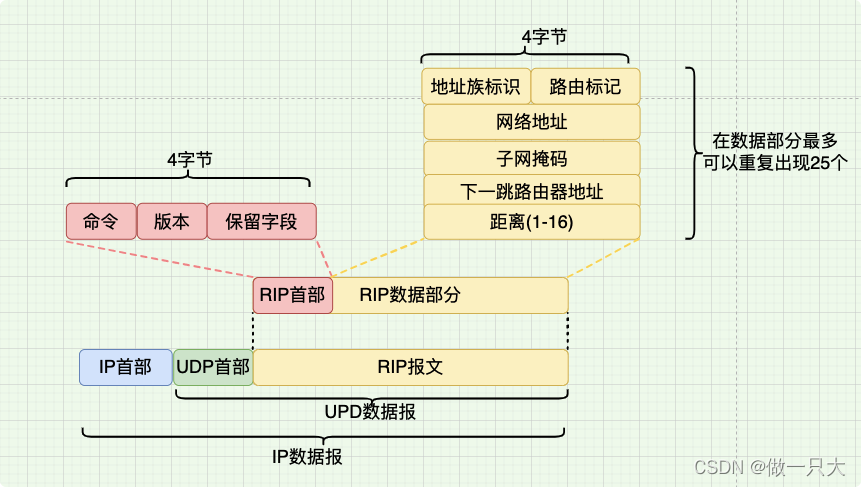
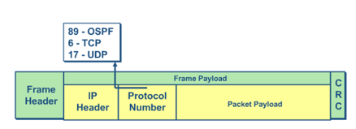
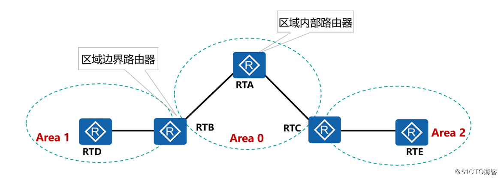

------

[TOC]

------

### IP

#### IP数据报格式

- 首部=20字节固定部分+可选部分（4字节的倍数）

- 首部长度（4bit）：单位4字节，只有固定部分0101（20字节），最多为1111（60字节）

- 总长度（16bit）：首部+数据，最大为2^16-1=65535字节

- IPv4地址（32bit）：4字节，IPv6地址为128bit（16字节）

- 首部检验和（16bit）：

  

------

#### IP地址的编址方式

##### 阶段一：分类（A-E）

- A类地址：（0~~127）-2=126个可用地址，网络号=0为网络上的特定主机，网络号=127为环回地址。

- B类地址：（128.0~~191.255）-2=2^14-2个可用，其中128.0和191.255作为保留地址

- C类地址：（192.0.0~~223.255.255）-2=2^21-2个可用，其中192.0.0和223.255.255作为保留地址

- D类地址：（224.0.0.0~~239.255.255.255），没有主机号，用于组播

- 主机号全为0表示该网段地址，主机号全为1为该网段广播地址

  

##### 阶段二：子网掩码

由二级IP地址<网络号，主机号>，到三级IP地址<网络号，子网号，主机号>

##### 阶段三：无分类编址CIDR、超网

IP地址=<网络前缀，主机号> ，如192.168.1.0/24，。/之后表示前缀的位数

##### 私有地址

------

### ICMP

#### ICMP协议

**「Internet Control Message Protocol」**：因特网控制报文协议，网络层协议。功能是检错，提供可能发生在通信环境中的各种问题的反馈。

- 封装为IP数据包，（IP数据包中协议类型为1）

------

#### ICMP报文

- **查询报文**

  1. Echo Request 回显请求（type=8）和 Echo Reply 回显响应（type=0）

     组合起来可以确定两个主机是否可以彼此通信。

     应用：**「Ping」**

     A ping B：A构建ICMP回显请求报文发给B，B收到后发回A回显应答报文

     

- **差错报文**

  1. 目的不可达

  2. 重定向

  3. 超时通知

     应用：**「TraceRoute」**

     向目的地发送探测包，根据返回的ICMP超时通知报文得到源和目的地之间的路由信息

### IGMP

**【IGMP，Internet Group Management Protocol，因特网组管理协议】**，负责IPv4组播成员管理。

*应用场景*：视频源端发送UDP组播数据流，客户端通过加入组播组，来接收数据流。

客户端要发送*IGMP Join Group*申请加入组播组，发送*IGMP Leave Group*离开组播组。

### ARP

**【ARP，Address Resolution Protocol，地址解析协议】**，根据IP地址获取MAC地址。

*应用场景*：在局域网内，通过交换机传输帧（路由器是和外网通信的），帧中有MAC地址，主机之间通信需要MAC地址。目的主机MAC地址的获取是通过ARP协议解析的。**在主机发送帧之前将目标IP转换为MAC地址。填写好访问数据链路层MAC帧中。**

A主机获取B主机的MAC地址的过程：

- *B在局域网*

1. 首先查看本地ARP缓存表，是否有IP对应MAC地址信息。
2. 如果无，则使用ARP协议获取。A向<u>局域网内发送封装ARP请求报文的广播帧</u>，携带A的IP和MAC，以及B的IP。
3. 本局域网的主机C收到后发现报文内IP不是自己的IP，则丢弃。
4. 如果B在局域网内，收到请求帧后，向A发送封装ARP响应报文的单播帧，携带B的MAC地址。

- *B在不同局域网*

1. A向B发送IP报文，先向ARP查询主机B的IP地址，发现不在一个网段，此时ARP将查询网关（默认路由）的MAC地址。
2. 如果没有网关MAC地址，在局域网内广播ARP查询，获取后将<主机B的IP地址，网关MAC>写入缓存和IP报文。
3. 网关收到报文后发现IP不是自己，在ARP缓存表中查找B的MAC，如果没有查到，再查找B所在网段的网关MAC地址。填入IP数据报并发送。
4. 重复上述过程知道B接收到IP数据报。

### 路由协议

#### RIP[^4]

**【Routing Information Protocol，路由信息协议】**：基于==距离向量==算法的路由协议。RIP报文封装在UDP数据报中

属于==内部网关路由协议==，利用**跳数**作为选择标准，达到16视为不可达。所以适用于小规模网络。

- *信息交换*：只和相邻的路由器交换信息，交换自己路由表中的信息。
- *更新频率*：每30s交换一次并更新路由表。
- *路由选择*：选择跳数最小的。
- *缺点*：只适用于小规模网络；跳数并非总是最优路径；好消息快，坏消息慢。

#### OSPF[^1][^2][^3]

**【Open Shortest Path First，开放最短路径优先】**：开放指的是不受厂商限制，所有人都可以使用。==链路状态协议==，封装到IP数据报中，协议号89。

属于==内部网关路由协议（IGP）==，工作在单个AS。相比于RIP，更适合大规模网络（划分区域）。

**区域划分**：每个区域负责内部LSA传递和计算，LSA简化汇总之后发送给另一个区域。

- 骨干区域Area0：所有区域和骨干区域直连，

- 区域边界路由器ABR：与其他区域通信

- 自治系统边界路由器ASBR：与外部AS通信

- *链路状态通告（LSA）*：在路由器之间通告的拓扑和路由信息。

- *链路cost*：1 0000 0000/带宽，带宽越大，cost越小
- *信息交换*：每个路由器将自己的链路状态信息洪泛到整个网络，这样最终每个路由器都能得到所有路由器的链路状态，形成网络拓扑。
- *路由计算*：Dijkstras，计算到每个目的地的最短路径，并填充路由表。
- *路由更新*：
  - 触发更新：网络变化则更新，无则每30min更新一次。
  - 增量更新：只需发送变化的LSA。

#### BGP

**【Border Gateway Protocol，边界网关协议】**：属于==外部网关路由协议（EGP）==，BGP报文封装在TCP中，端口179。基于==路径向量算法==。

- *信息交换*：与邻居AS交换路由表信息
- *路由选择*：选择代价最小的路由
- *更新频率*：触发增量更新

#### 组播路由协议PIM

### 参考

[^1]:[OSPF协议介绍_zzjieee的博客-CSDN博客_ospf协议](https://blog.csdn.net/zzj244392657/article/details/92617311?spm=1001.2101.3001.6650.1&utm_medium=distribute.pc_relevant.none-task-blog-2~default~CTRLIST~Rate-1-92617311-blog-92795770.pc_relevant_paycolumn_v3&depth_1-utm_source=distribute.pc_relevant.none-task-blog-2~default~CTRLIST~Rate-1-92617311-blog-92795770.pc_relevant_paycolumn_v3&utm_relevant_index=2)
[^2]:[路由选择协议(二) OSPF协议_做一只大熊猫的博客-CSDN博客_ospf路由选择协议](https://blog.csdn.net/qq_34261446/article/details/104642358)
[^3]:[计算机网络：OSPF协议概述_Zeker62的博客-CSDN博客_ospf协议](https://blog.csdn.net/ZripenYe/article/details/117111932?spm=1001.2101.3001.6650.12&utm_medium=distribute.pc_relevant.none-task-blog-2~default~BlogCommendFromBaidu~Rate-12-117111932-blog-92795770.pc_relevant_paycolumn_v3&depth_1-utm_source=distribute.pc_relevant.none-task-blog-2~default~BlogCommendFromBaidu~Rate-12-117111932-blog-92795770.pc_relevant_paycolumn_v3&utm_relevant_index=17)
[^4]:[路由选择协议(一) RIP协议_做一只大熊猫的博客-CSDN博客_rip协议](https://blog.csdn.net/qq_34261446/article/details/124444097)

